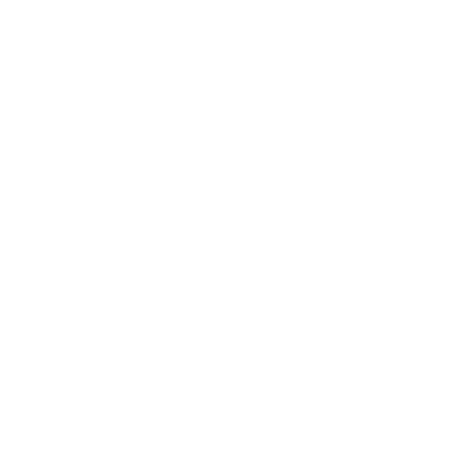
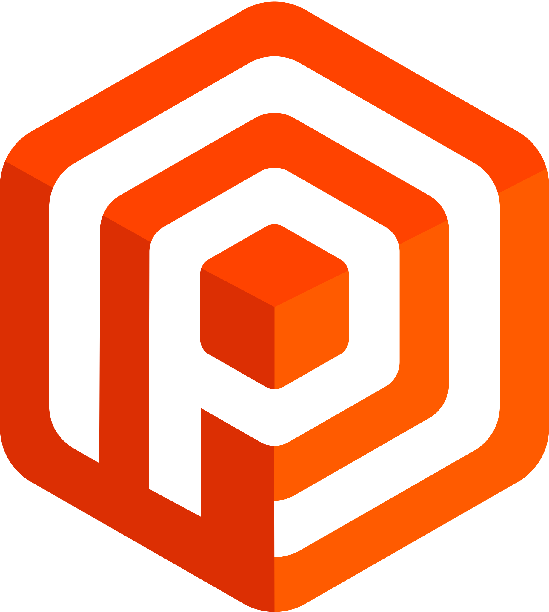

## 안녕하세요! 👋

Hi, I'm Donghyun Won, a Newbie Game Client Programmer.

- 🎮 Game Client UE4 Programmer, **Nexon Korea** (Since 2021. 10. 25)

- 🎓 I’m currently going through the Senior Year in the Hongik Univ.

- 👨‍💼 2021 Summer Internship at NCSOFT.

- 😎 Familiar with `Unreal Engine 4`, `Unity3D`, `C++` and `C#` !

- 👊 Getting to Know `Design Pattern` and `Game AI` !

- 📖 Study Notes => 
	
### Connect with me:

	
    	
	

### Tech Stack I'm Familiar With:

	
	
	
    	
	
	
	

 

<!-- ### Tech Stack I'm Learning:

 -->
